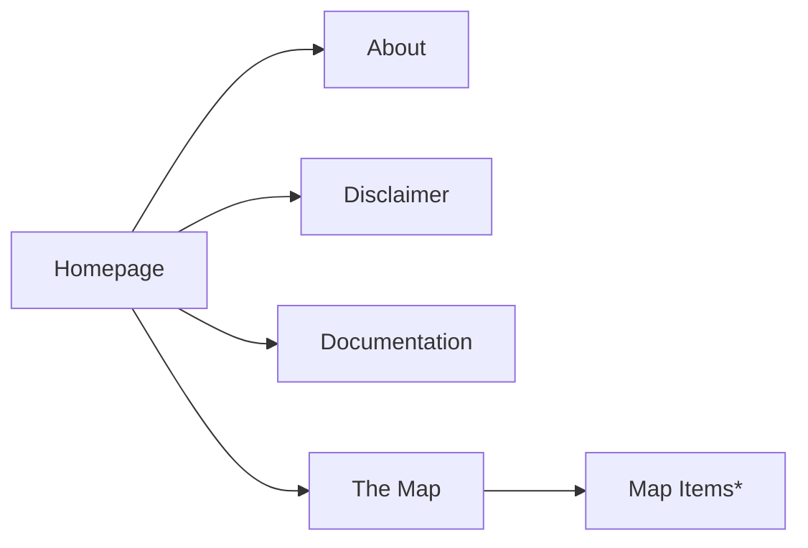
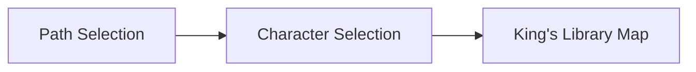

## Introduction

The Middle Earth Cabinet is a Project Website following the guidelines for the 2024-2025 a.y. valid for the exam "Information Modeling and Web Technologies".

### 1.1 Purpose of this Document

This document has the purpose of providing a complete documentation of the work done. It urges to be comprehensive and extensive, describing every individual aspect of the website itself.

### 1.2 Audience

The selected audience for this website is, by design, diverse and the website itself is built to give to each and every user the tools to enforce this flexibility.

The three main groups described by the requirements include:

-   Elementary and Middle School kids.
-   Average museum visitors with different available time for the visit.
-   Users that are experts in the domain (in our case the so called «Tolkien Scholars») or users that want a deep dive and have some time to spend for the exhibit.

The functionality allowing users to adjust the length and complexity of the text for each exhibit across three levels per axis will be discussed in detail later. For now, it's important to understand that this feature allows for tailored information delivery.

This led us to work on a small description and metadata database described in JSON, for a total of 9 descriptions per exhibit.

### 1.3 Scope of the Website

This Website serves as an online guide and tour for the imaginary exhibition «The Middle Earth Cabinet». The Scope of the Website is therefore to provide the adequate informational content tailored for the target audience and presented in a streamlined and intuitive way, but also to be informative about the location of the exhibit and transparent about the curators.

### 1.4 Document Conventions

The terminology of the documentation will make use of technical jargon and it will refer to common practices in a familiar way, confident that those who read it are knowledgeable enough to understand it.

### 1.5 Contact Information for Support

Our <a href="about.html">About</a> page is here for any information or support.

## Website Overview and Architecture

### 2.1 Website Goals and Objectives

As mentioned before the goal is to obtain an easy to use and intuitive system that can be easily reproduced for a different exhibition. It tries to be compliant with the exam requirements and adds some facilities where needed to support its goals.

### Hosting

«The Middle Earth Cabinet» is hosted making use of [Github Pages](https://pages.github.com/), starting from a [repository](https://github.com/falaimo99/webdev) hosted on one of the curators and developers [github account](https://github.com/falaimo99).

### 2.2.1 Frontend Technologies

The Website makes use of the "traditional" frontend stack, (HTML, CSS, JS). It tends to adopt a modular approach, that separates html pages, style and scripts on different files.

### 2.2.2 Backend Technologies

The requirements of the project don't comprehend a backend part development, the only "backend" part is assolved by the hosting system.

The only other consideration about backend is about internal data retrieval, the Project make use of an items.json file to retrieve the informational content to display for the exhibition.

### 2.3 Data Flow and Interactions

## Frontend Development

### 3.1 Website Structure and Navigation

The website structure is fairly simple having only one job in mind. Navigation is facilitated by the presence of recognizable buttons and an attempt to respect visual hyerarchy among the elements at screen.

Starting from the index/homepage it is possible to visit one of the functional pages (about, docs, disclaimer), and a suggested access to the main feature of the website, "The Map" page, from which you can start exploring the collection.

### 3.1.1 Sitemap

_This chart was realized using [mermaid](https://mermaid.js.org/)_

\* these are not pages but are still treated as relevant elements.

### 3.1.2 User Interface (UI) Design Principles

We tried to stick to the basic UI Design Principles without outlining our own requirements.
We followed common sense regarding matters of readability and interaction facilities at user's disposal.

### 3.1.3 Responsive Design and Mobile Compatibility

Is yet to be implemented! Not present in the requirements.

### 3.2 Page Templates and Components

The pages are few enough to make it available for us to devise unique designs for each of them. Trying to retain a coherent aesthetic.

Consistent templates are present in:

-   button styling
-   exhibit cards

### 3.2.1 Homepage

The index/homepage is strongly inspired by The British Museum one, being this imaginary exhibition staged inside "The King's Library", the first series of rooms indexed in the [Official Map](https://www.britishmuseum.org/visit/museum-map) of the aforementioned museum.

The homepage features:

-   A pitch black header bar containing the links to the functional pages (about, disclaimer, docs)
-   A background video that merges real life Tolkien artifacts and clips with movies clips from «The Lord Of The Rings» Trilogy, it was realized using the open source video editor [kdenlive](https://kdenlive.org/)
-   A small tooltip box containing some informative text about the exhibition and a slightly bigger button leading to "The Map" the main feature of the website.

The differences with the British Museum website are to be found in layout, we have of course fewer elements to deal with; and overflowing, we decided to have a static full-viewport homepage, while the BM site has to include many more elements below their bar and background video.

### 3.2.2 "The Map" Page

This is the page that guides the user through the exhibition, this is a graph representation of the user interaction, this acts as a "setup phase" that allows the user to select their level and how they want to visit.

_This chart was realized using [mermaid](https://mermaid.js.org/)_

After the setup phase the user is able to explore the map in different ways:

-   if they selected a Path, the map will zoom and pan to focus on the museum section dedicated to it, highlighted with the theme colour of that path. It will then appear a "Start your journey" button that will guide you through the right order of appearance of the exhibits.
-   if they selected free roam they can freely explore each and every item available without an order.

A useful "Resume your Journey" button will substitute the "Star your Journey" one, and will make it possible to resume from the last item you selected.

Besides the map are available two buttons, one to return back to the homepage and another to visualize the british museum map, and a link that leads the user to the original source, in this view is also highlighted the actual exhibition location.

#### Map Svg

The process to realize the svg that allows the map to function was rather simple but required some work and refinements, the map was traced using the official map provided by the British Museum, at first using [figma](https://www.figma.com) and then refined using [inkscape](https://www.inkscape.com).

It is implemented using the `<svg>` element in html, and it was used to simplify the interaction scripts at work that will be later described.

### 3.2.3 Exhibit Card

Each exhibit card follows the same template. The first set of information at display is the museal description of the item, adjustable per level and length through radio buttons. You can also access, with dedicated buttons, the available metadata and map for each item.

### 3.2.4 Information Pages (About, Disclaimer, Docs )

### 3.2.5 Multimedia Integration (Images, Videos, Audio)

### 3.3 JavaScript Functionality

### 3.3.1 User Interactions and Event Handling

### 3.3.2 Asynchronous Data Loading (AJAX)

### 3.3.3 Third-Party Integrations (e.g., Analytics, Maps)

### 3.3.4 State Management (if applicable)

### 3.4 Styling and Theming (CSS)

### 3.4.1 Style Guides and Conventions

IV. Backend Development

### 4.1 Server-Side Logic and APIs

### 4.1.1 API Endpoints and Specifications

### 4.1.2 Data Validation and Sanitization

### 4.1.3 Business Logic Implementation

### 4.2 Database Design and Management

### 4.2.1 Database Schema (Diagram and Description of Tables, Fields, Relationships)

### 4.2.2 Data Models and Entities

### 4.2.3 Data Access Layer

### 4.2.4 Database Backup and Recovery Procedures

### 4.3 Content Management System (CMS) (if applicable)

### 4.3.1 CMS Architecture and Components

### 4.3.2 Content Modeling and Structure within the CMS

### 4.3.3 User Roles and Permissions within the CMS

### 4.3.4 Workflow for Content Creation and Publishing

### 4.4 Security Implementation (Detailed)

### 4.4.1 Authentication and Authorization Mechanisms

### 4.4.2 Protection Against Common Web Vulnerabilities (e.g., XSS, SQL Injection)

### 4.4.3 Data Encryption (at rest and in transit)

### 4.4.4 Security Auditing and Logging

V. Content Management

### 5.1 Content Creation Guidelines

### 5.1.1 Text Formatting and Style

### 5.1.2 Image and Multimedia Guidelines (e.g., file formats, sizes, optimization)

### 5.1.3 Metadata and SEO Considerations

### 5.2 Content Workflow and Publishing Process

### 5.3 Managing Exhibition Data

### 5.3.1 Data Input and Validation Procedures

### 5.3.2 Linking Exhibits to Multimedia and Other Information

### 5.3.3 Version Control for Exhibition Data (if applicable)

### 5.4 Managing Static Content (e.g., About Us, Contact)

VI. Interactive Features (if applicable)

### 6.1 Virtual Tours

### 6.1.1 Technology Used (e.g., Panoramas, 3D Scans)

### 6.1.2 User Controls and Navigation

### 6.1.3 Data Storage and Delivery

### 6.2 3D Models of Artifacts

### 6.2.1 File Formats and Optimization

### 6.2.2 Embedding and Interaction within the Website

### 6.3 Interactive Maps and Location Information

### 6.4 User Engagement Features (e.g., Comments, Sharing)

V

### 10.1 Deployment Process and Procedures

### 10.2 Server Configuration and Management

### 10.3 Monitoring and Logging

### 10.4 Backup and Recovery Procedures

### 10.5 Software Updates and Patch Management

### 10.6 Ongoing Maintenance Tasks

### 10.7 Troubleshooting Common Issues

XII. Analytics and Reporting

### 12.1 Tracking Tools and Implementation (e.g., Google Analytics)

### 12.2 Key Performance Indicators (KPIs) for the Website

### 12.3 Reporting Procedures and Frequency

XIII. Glossary

### Definition of Technical Terms and Acronyms Used in the Document

XIV. Appendices (if applicable)

### A. Database Schema Diagrams

### B. API Documentation (e.g., using Swagger/OpenAPI)

### C. Style Guides

### D. Wireframes or Mockups (if relevant to technical implementation)

### E. Future Developments and current issues
