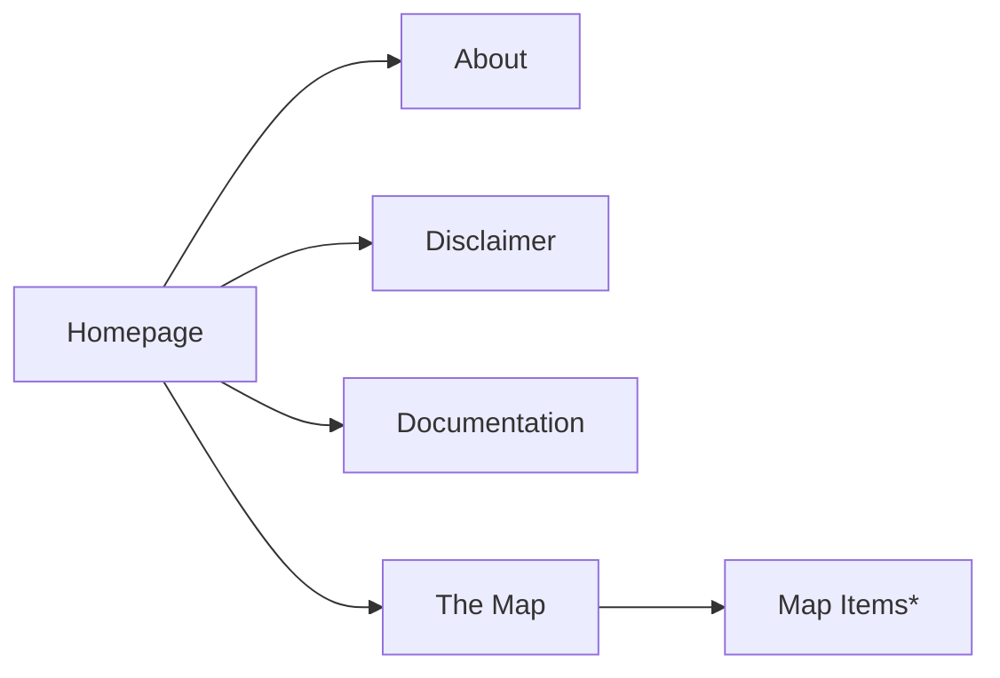
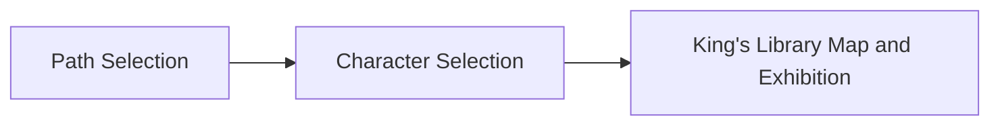

## Introduction

The Middle Earth Cabinet is a Project Website following the guidelines for the 2024-2025 a.y. valid for the exam "Information Modeling and Web Technologies".

### 1.1 Purpose of this Document

This document has the purpose of providing a complete documentation of the work done. It urges to be comprehensive and extensive, describing every individual aspect of the website itself.

### 1.2 Audience

The selected audience for this website is, by design, diverse and the website itself is built to give to each and every user the tools to enforce this flexibility.

The three main groups described by the requirements include:

-   Elementary and Middle School kids.
-   Average museum visitors with different available time for the visit.
-   Users that are experts in the domain (in our case the so called «Tolkien Scholars») or users that want a deep dive and have some time to spend for the exhibit.

The functionality allowing users to adjust the length and complexity of the text for each exhibit across three levels per axis will be discussed in detail later. For now, it's important to understand that this feature allows for tailored information delivery.

This led us to work on a small description and metadata database described in JSON, for a total of 9 descriptions per exhibit.

### 1.3 Scope of the Website

This Website serves as an online guide and tour for the imaginary exhibition «The Middle Earth Cabinet». The Scope of the Website is therefore to provide the adequate informational content tailored for the target audience and presented in a streamlined and intuitive way, but also to be informative about the location of the exhibit and transparent about the curators.

### 1.4 Document Conventions

The terminology of the documentation will make use of technical jargon and it will refer to common practices in a familiar way, confident that those who read it are knowledgeable enough to understand it.

### 1.5 Contact Information for Support

Our <a href="about.html">About</a> page is here for any information or support.

## Website Overview and Architecture

### 2.1 Website Goals and Objectives

As mentioned before the goal is to obtain an easy to use and intuitive system that can be easily reproduced for a different exhibition. It tries to be compliant with the exam requirements and adds some facilities where needed to support its goals.

### 2.2 Hosting

«The Middle Earth Cabinet» is hosted making use of [Github Pages](https://pages.github.com/), starting from a [repository](https://github.com/falaimo99/webdev) hosted on one of the curators and developers [github account](https://github.com/falaimo99).

### 2.3.1 Frontend Technologies

The Website makes use of the "traditional" frontend stack, (HTML, CSS, JS). It tends to adopt a modular approach, that separates html pages, style and scripts on different files.

### 2.3.2 Backend Technologies

The requirements of the project don't comprehend a backend part development, the only "backend" part is assolved by the hosting system.

The only other consideration about backend is about internal data retrieval, the Project make use of an items.json file to retrieve the informational content to display for the exhibition.

### 2.4 Data Flow and Interactions

## Frontend Development

### 3.1 Website Structure and Navigation

The website structure is fairly simple having only one job in mind. Navigation is facilitated by the presence of recognizable buttons and an attempt to respect visual hyerarchy among the elements at screen.

Starting from the index/homepage it is possible to visit one of the informational pages (about, docs, disclaimer), and an highlighted access to the main feature of the website, "The Map" page, from which you can start exploring the collection.

### 3.1.1 Sitemap

_This chart was realized using [mermaid](https://mermaid.js.org/)_

\* these are not pages but are still treated as relevant elements.

### 3.1.2 User Interface (UI) Design Principles

We tried to stick to the basic UI Design Principles without outlining our own requirements.
We followed common sense regarding matters of readability and interaction facilities at user's disposal.

### 3.1.3 Responsive Design and Mobile Compatibility

Is yet to be implemented! Not present in the requirements.

### 3.2 Page Templates and Components

The pages are few enough to make it available for us to devise unique designs for each of them. Trying to retain a coherent aesthetic.

Consistent templates are present in:

-   button styling
-   exhibit cards

### 3.2.1 Homepage

The index/homepage is strongly inspired by The British Museum one, being this imaginary exhibition staged inside "The King's Library", the first series of rooms indexed in the [Official Map](https://www.britishmuseum.org/visit/museum-map) of the aforementioned museum.

The homepage features:

-   A pitch black header bar containing the links to the informational pages (about, disclaimer, docs)
-   A background video that merges real life Tolkien artifacts and clips with movies clips from «The Lord Of The Rings» Trilogy, it was realized using the open source video editor [kdenlive](https://kdenlive.org/)
-   A small tooltip box containing some informative text about the exhibition and a slightly bigger button leading to "The Map" the main feature of the website.

The differences with the British Museum website are to be found in layout, we have of course fewer elements to deal with; and overflowing, we decided to have a static full-viewport homepage, while the BM site has to include many more elements below their bar and background video.

### 3.2.2 "The Map" Page

This is the page that guides the user through the exhibition, this is a graph representation of the user interaction, this acts as a "setup phase" that allows the user how they want to visit and the difficulty of the descriptions. During this phase the user is presented with two `<dialog>` elements.

_This chart was realized using [mermaid](https://mermaid.js.org/)_

After the setup phase the user is able to explore the map in different ways:

-   if they selected a Path, the map will zoom and pan to focus on the museum section dedicated to it, highlighted with the theme colour of that path. It will then appear a "Start Journey" button that will guide you through the right order of appearance of the exhibits.
-   if they selected free roam they can freely explore each and every item available without an order.

A useful "Resume Journey" button will substitute the "Start Journey" one, and will make it possible to resume from the last item you selected.

Every Journey consists only of the selected items in that zone and will automatically reach an end when you get to the last one

Besides the map are available two buttons, one to return back to the homepage and another to visualize the british museum map, and a link that leads the user to the original source, in this view is also highlighted the actual exhibition location.

#### Map Svg

The process to realize the svg that allows the map to function was rather simple but required some work and refinements, the map was traced using the official map provided by the British Museum, at first using [figma](https://www.figma.com) and then refined using [inkscape](https://www.inkscape.com).

It is implemented using the `<svg>` element in html, and it was used to simplify the interaction scripts at work that will be later described.

### 3.2.3 Item Card

Each exhibit card follows the same template. The first set of information at display is the museal description of the item, adjustable per level and length through radio buttons. You can also access, with dedicated buttons, the available metadata and map for each item. The map is retrieved using [leaflet](https://leafletjs.com/) and [OpenStreetMap](https://www.openstreetmap.org/)

In each card you can also find arrows to move from one item to the other without using the map to select each one of them.

### 3.2.4 Informational Pages (About, Disclaimer, Docs)

The Informational pages give access to the relevant information for those interested in the project and its developers:

-   "About" provides a small overview of the team and links to their github profiles
-   "Disclaimer" provides legal text and the selected license, providing context to those who visit the project externally

### 3.3 JavaScript Functionality

All the relevant javascript code is contained into `scripts/script.js`, being all the pages except "The Map" page static it is relevant only for the functionalities described in paragraph 3.2.2 and 3.2.3.

Javascript is used for all the interactive functionality on the website, everything is managed client side. The script loads content coming from `data/items.json`, and adjusts it according to the choices made by the user during the setup phase. Javascript is also used to set the variables during the setup phase and to make them available throughout the session.

The functions provided regulate the behavior of the setup dialogs, of the British Museum Map dialog, and the item card content retrieval and displaying.

### 3.4 Styling and Theming (CSS)

The Styling and Theming is full of small references to Tolkien's work.
We'll try to outline them in this paragraph, it is a simple theming but we deem effective enough to please the eye.

As mentioned before the theme chosen for the homepage traces back to the British Museum Homepage, but we decided to add our own video background, selecting and intertwining real life clips of Tolkien and scenes from the movie, this is intended to create a visual reference to our two paths, the origin and the legacy.

The map contains a total different approach, we decided to adopt a colorful and yet simple style for it.

The main colors hint to Tolkien's world and life:

-   Gold for the legacy path, referring to the color of the ring.
-   Green for the origin path, Tolkien was notoriously fond of trees and nature, he included lots of descriptions of the natural world in his works.
-   Skyblue for some details, it is a color that is recurrent in important and mysterious characters.
-   Lighter bronze-brown, provides a good and pleasing base color for buttons, being close to the background dominating color.

The buttons are highlighted when hovered on and are rounded and solid, this creates a more modern look.

The map style is simple and vectorial, tuned for readability and to provide good contrast between background, map borders and items at display.

The background is the map of Middle Earth itself, blurred enough to avoid distraction.

In the "Adventurers" setup and the about page there are images from the film, to provide a sort of early 2000s reminiscence, when magazines, scrapbooks and archaic html websites were popular.

## Data Management

As mentioned earlier in this documentation the data for the items is provided via `json`, the data is still sparse and need to be cleared yet. We tried to provide a basic structure for the item cards and a small set of metadata information but it was truly a challenge to keep it consistent.

### 4.1 JSON Guidelines

The data schema can be easily adopted as is, and can be reproduced for other use cases. A further development could be redacting an effective JSON schema.

Every Item is described using the following properties:

-   An identfier,
-   An h1 and an h2 to show in the main view of the card
-   An image reference, it can be a link or a static local file
-   Various metadata descriptors coming mainly from [schema](https://www.schema.org) and [Dublin Core](https://www.dublincore.org/)
    -   Including, when available, relevant geographical coordinates
-   The nine descriptions that permit to adjust level and length, they were generated using an LLM providing the adequate (usually not much) context and then proofread.

## Appendices

### A. Wireframes or Mockups (if relevant to technical implementation)

This is the only available mockup, made at the start of the development, even if we didn't follow up and update

### B.

### C. Future Developments
